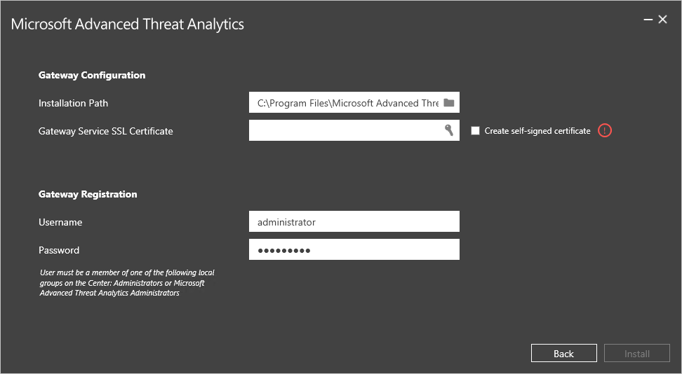

*Dotyczy: Advanced Threat Analytics, wersja 1.7*

# Instalowanie usługi ATA — Krok 4

>[!div class="step-by-step"]
[« Krok 3](install-ata-step3.md)
[Krok 5 »](install-ata-step5.md)

## Krok 4. Instalowanie bramy usługi ATA

Przed zainstalowaniem bramy usługi ATA na dedykowanym serwerze zweryfikuj, czy funkcja dublowania portów jest poprawnie skonfigurowana oraz czy ruch do i z kontrolerów domeny jest widoczny dla bramy usługi ATA. Aby uzyskać więcej informacji, zobacz [Weryfikowanie funkcji dublowania portów](validate-port-mirroring.md).

> [!IMPORTANT]
> Upewnij się, że aktualizacja [KB2919355](http://support.microsoft.com/kb/2919355/) została zainstalowana.  Uruchom następujące polecenie cmdlet programu PowerShell, aby sprawdzić, czy zainstalowano poprawkę:
>
> `Get-HotFix -Id kb2919355`

Na serwerze bramy usługi ATA wykonaj następujące kroki.

1.  Wyodrębnij pliki z archiwum zip. 
> [!NOTE] 
> Instalowanie bezpośrednio z pliku zip zakończy się niepowodzeniem.

2.  Uruchom plik **Microsoft ATA Gateway Setup.exe**, a następnie postępuj zgodnie z instrukcjami kreatora instalacji.

3.  Na stronie **Zapraszamy** wybierz swój język i kliknij przycisk **Dalej**.

4.  Kreator instalacji automatycznie sprawdzi, czy serwer jest kontrolerem domeny czy serwerem dedykowanym. Jeśli jest to kontroler domeny, zostanie zainstalowana brama ATA Lightweight Gateway. Jeśli jest to dedykowany serwer, zostanie zainstalowana brama usługi ATA. 
    
    Na przykład w przypadku bramy ATA Lightweight Gateway zostanie wyświetlony następujący ekran z informacją, że brama ATA Lightweight Gateway zostanie zainstalowana na kontrolerze domeny:
    
     Kliknij przycisk **Dalej**.

    > [!NOTE] 
    > Jeśli kontroler domeny lub dedykowany serwer nie spełnia minimalnych wymagań sprzętowych dotyczących instalacji, zostanie wyświetlone ostrzeżenie. To nie uniemożliwia kliknięcia przycisku **Dalej** ani kontynuowania instalacji. Ta opcja może być właściwa w przypadku instalacji usługi ATA w małym, laboratoryjnym środowisku testowym, w którym nie potrzeba tak dużo miejsca do przechowywania danych. W środowiskach produkcyjnych zdecydowanie zaleca się korzystanie z przewodnika [planowania pojemności](/advanced-threat-analytics/plan-design/ata-capacity-planning) usługi ATA w celu upewnienia się, że kontrolery domeny lub dedykowane serwery spełniają niezbędne wymagania.

4.  W obszarze **ATA Gateway Configuration** (Konfiguracja bramy usługi ATA) wprowadź następujące informacje w zależności od używanego środowiska:

    

    |Pole|Opis|Komentarze|
    |---------|---------------|------------|
    |Ścieżka instalacji|Lokalizacja, w której zostanie zainstalowana brama usługi ATA. Domyślna lokalizacja to %programfiles%\Microsoft Advanced Threat Analytics\Gateway|Pozostaw wartość domyślną.|
    |Certyfikat SSL usługi bramy|Certyfikat, który będzie używany przez bramę usługi ATA.|Certyfikatu z podpisem własnym należy używać tylko w przypadku środowisk laboratoryjnych.|
    |Rejestracja bramy|Wprowadź nazwę użytkownika i hasło administratora usługi ATA.|Aby zarejestrować bramę usługi ATA w centrum usługi ATA, wprowadź nazwę i hasło użytkownika, który zainstalował centrum usługi ATA. Ten użytkownik musi należeć do jednej z następujących grup lokalnych w centrum usługi ATA.  — Administratorzy — Administratorzy usługi Microsoft Advanced Threat Analytics (**Uwaga:** te poświadczenia są używane tylko do rejestracji i nie są przechowywane w usłudze ATA)|
    
5. Kliknij przycisk **Zainstaluj**. Następujące składniki zostaną zainstalowane i skonfigurowane podczas instalacji bramy usługi ATA:

    -   KB 3047154 (tylko dla systemu Windows Server 2012 R2)

        > [!IMPORTANT]
        > -   Nie należy instalować aktualizacji KB 3047154 na hoście wirtualizacji (host, który uruchamia wirtualizację; można uruchomić ją na maszynie wirtualnej). Może to spowodować nieprawidłowe działanie funkcji dublowania portów. 
        > -   Nie instaluj programu Message Analyzer, programu Wireshark ani innego oprogramowania służącego do przechwytywania ruchu sieciowego w ramach bramy usługi ATA. Jeśli zachodzi potrzeba przechwytywania ruchu sieciowego, zainstaluj i zastosuj program Microsoft Network Monitor 3.4.

    -   Brama usługi ATA

    -   Pakiet redystrybucyjny Microsoft Visual C++ 2013

    -   Niestandardowy zestaw kolekcji danych monitora wydajności

5.  Po zakończeniu instalacji w przypadku bramy usługi ATA kliknij przycisk **Uruchom**, aby otworzyć przeglądarkę, i zaloguj się do konsoli usługi ATA. W przypadku bramy ATA Lightweight Gateway kliknij przycisk **Zakończ**.

>[!div class="step-by-step"]
[« Krok 3](install-ata-step3.md)
[Krok 5 »](install-ata-step5.md)

## Zobacz też

- [Forum usługi ATA](https://social.technet.microsoft.com/Forums/security/home?forum=mata)
- [Konfigurowanie zbierania zdarzeń](configure-event-collection.md)
- [Wymagania wstępne usługi ATA](/advanced-threat-analytics/plan-design/ata-prerequisites)

<!--HONumber=Feb17_HO1-->

