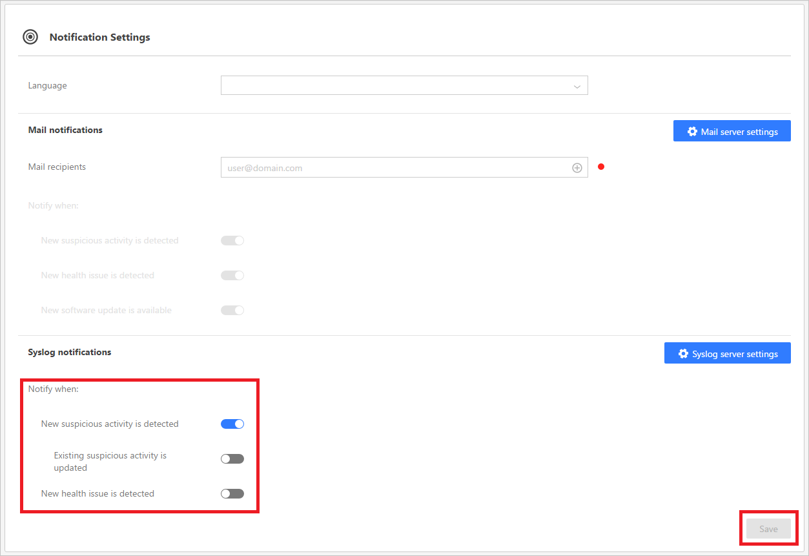

*Dotyczy: Advanced Threat Analytics, wersja 1.7*

# Ustawianie powiadomień usługi ATA
Usługa ATA może wysyłać powiadomienia w przypadku wykrycia podejrzanych działań za pośrednictwem poczty e-mail lub przy użyciu funkcji przekazywania zdarzeń usługi ATA, przekazując zdarzenia do serwera SIEM/Syslog. Zanim określisz, które powiadomienia chcesz otrzymywać, musisz [skonfigurować serwer poczty e-mail i serwer Syslog](setting-syslog-email-server-settings.md).

> [!NOTE]
> -   Powiadomienia e-mail zawierają link powodujący otwarcie informacji o podejrzanym działaniu, które zostało wykryte. Część linku zawierająca nazwę hosta jest pobierana z ustawienia adresu URL konsoli usługi ATA na stronie centrum usługi ATA. Domyślnie adres URL konsoli usługi ATA jest adresem IP wybranym podczas instalacji centrum usługi ATA.  Zalecane jest użycie nazwy FQDN jako adresu URL konsoli usługi ATA w celu skonfigurowania powiadomień e-mail.
> -   Powiadomienia są wysyłane z centrum usługi ATA do serwera SMTP i serwera Syslog.

## Powiadomienia pocztowe
Aby otrzymywać powiadomienia pocztowe, określ następujące ustawienia:

1. Na pasku narzędzi w konsoli usługi ATA wybierz opcję ustawień, a następnie wybierz pozycję **Konfiguracja**.

2. W obszarze **Powiadomienia** wybierz pozycję **Ustawienia**.
3. W obszarze **Adresaci poczty** określ adresatów, którzy będą otrzymywać powiadomienia pocztą e-mail.

    [!Uwaga:] Alerty e-mail dotyczące podejrzanych działań są wysyłane wyłącznie po utworzeniu podejrzanego działania.

4. W obszarze **Powiadom gdy:** użyj przełączników, aby wybrać powiadomienia, które mają być wysyłane:

    - Wykryto nowe podejrzane działanie
    - Wykryto nowy problem z kondycją
    - Dostępna jest nowa aktualizacja oprogramowania

5. Kliknij polecenie **Zapisz**.

## Powiadomienie Syslog

Aby otrzymywać powiadomienia Syslog, określ następujące ustawienia:

1. Na pasku narzędzi w konsoli usługi ATA wybierz opcję ustawień, a następnie wybierz pozycję **Konfiguracja**.

2. W obszarze **Powiadomienia** wybierz pozycję **Ustawienia**.
3. W obszarze **Powiadomienia Syslog** użyj przełączników, aby wybrać powiadomienia, które mają być wysyłane:

    - Wykryto nowe podejrzane działanie
    - Zaktualizowano istniejące podejrzane działanie
    - Wykryto nowy problem z kondycją
5. Kliknij polecenie **Zapisz**.

## Zobacz też
[Zapoznaj się z forum usługi ATA!](https://social.technet.microsoft.com/Forums/security/home?forum=mata)

<!--HONumber=Aug16_HO5-->

