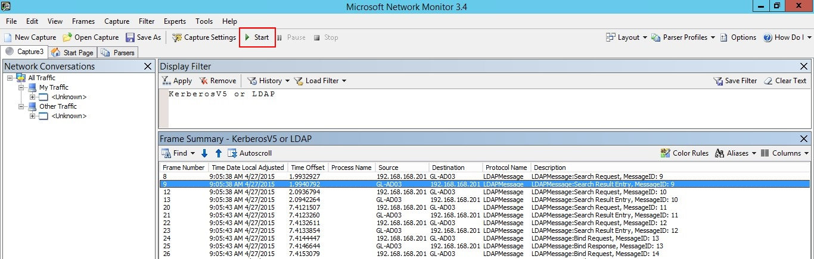

*Dotyczy: Advanced Threat Analytics, wersja 1.7*

# Weryfikowanie funkcji dublowania portów
> [!NOTE] 
> Ten artykuł dotyczy wyłącznie sytuacji, gdy zamiast bram ATA Lightweight Gateway są wdrażane bramy usługi ATA. Aby ustalić, czy konieczne jest użycie bram usługi ATA, zobacz artykuł [Wybieranie odpowiednich bram dla wdrożenia](/advanced-threat-analytics/plan-design/ata-capacity-planning#choosing-the-right-gateway-type-for-your-deployment).
 
W poniższych krokach objaśniono proces weryfikowania, czy funkcja dublowania portów jest poprawnie skonfigurowana. Aby usługa ATA mogła działać prawidłowo, ruch do i z kontrolera domeny musi być widoczny dla bramy usługi ATA. Główne źródło danych używane przez usługę ATA to głęboka inspekcja pakietów ruchu sieciowego do i z kontrolerów domeny. Aby ruch sieciowy był widoczny dla usługi ATA, należy skonfigurować funkcję dublowania portów. Funkcja dublowania portów kopiuje ruch z jednego portu (portu źródłowego) do innego portu (portu docelowego).

## Weryfikowanie funkcji dublowania portów za pomocą skryptu programu Windows PowerShell

1. Zapisz tekst tego skryptu w pliku o nazwie *ATAdiag.ps1*.
2. Uruchom ten skrypt w bramie usługi ATA, którą chcesz zweryfikować.
Skrypt generuje ruch ICMP z bramy usługi ATA do kontrolera domeny oraz szuka tego ruchu na karcie sieciowej przechwytywania na kontrolerze domeny.
Jeśli brama usługi ATA widzi ruch ICMP z takim samym docelowym adresem IP jak adres IP kontrolera domeny wprowadzony w konsoli usługi ATA, uznaje dublowanie portów za skonfigurowane. 

Przykład sposobu uruchamiania skryptu:

    # ATAdiag.ps1 -CaptureIP n.n.n.n -DCIP n.n.n.n -TestCount n
    
    param([parameter(Mandatory=$true)][string]$CaptureIP, [parameter(Mandatory=$true)][string]$DCIP, [int]$PingCount = 10)

    # Set variables
    
        $ErrorActionPreference = "stop"
    $starttime = get-date
    $byteIn = new-object byte[] 4
    $byteOut = new-object byte[] 4
    $byteData = new-object byte[] 4096  # size of data
    
    $byteIn[0] = 1  # for promiscuous mode
    $byteIn[1-3] = 0
    $byteOut[0-3] = 0

    # Convert network data to host format
        function NetworkToHostUInt16 ($value)
        {
        [Array]::Reverse($value)
        [BitConverter]::ToUInt16($value,0)
        }
    
    function NetworkToHostUInt32 ($value)
        {
        [Array]::Reverse($value)
        [BitConverter]::ToUInt32($value,0)
        }
    
    function ByteToString ($value)
        {
        $AsciiEncoding = new-object system.text.asciiencoding
        $AsciiEncoding.GetString($value)
            }
    
    Write-Host "Testing Port Mirroring..." -ForegroundColor Yellow
    Write-Host ""
    Write-Host "Here is a summary of the connection we will test." -ForegroundColor Yellow

    # Initialize a first ping connection
    Test-Connection -Count 1 -ComputerName $DCIP -ea SilentlyContinue
    Write-Host ""
    
    Write-Host "Press any key to continue..." -ForegroundColor Red
    [void][System.Console]::ReadKey($true)
    Write-Host ""
    Write-Host "Sending ICMP and Capturing data..." -ForegroundColor Yellow
    
    # Open a socket
    
    $socket = new-object system.net.sockets.socket([Net.Sockets.AddressFamily]::InterNetwork,[Net.Sockets.SocketType]::Raw,[Net.Sockets.ProtocolType]::IP)
    
    # Include the IP header
    $socket.setsocketoption("IP","HeaderIncluded",$true)
    
    $socket.ReceiveBufferSize = 10000
    
    $ipendpoint = new-object system.net.ipendpoint([net.ipaddress]"$CaptureIP",0)
    $socket.bind($ipendpoint)
    
    # Enable promiscuous mode
    [void]$socket.iocontrol([net.sockets.iocontrolcode]::ReceiveAll,$byteIn,$byteOut)
    
    # Initialize test variables
    $tests = 0
    $TestResult = "Noise"
    $OneSuccess = 0
    
    while ($tests -le $PingCount)
        {
        if (!$socket.Available)  # see if any packets are in the queue
            {
            start-sleep -milliseconds 500
            continue
            }
    
    # Capture traffic
        $rcv = $socket.receive($byteData,0,$byteData.length,[net.sockets.socketflags]::None)
    
    # Decode the header so we can read ICMP
    
        $MemoryStream = new-object System.IO.MemoryStream($byteData,0,$rcv)
        $BinaryReader = new-object System.IO.BinaryReader($MemoryStream)
    
    # Set IP version & header length
        $VersionAndHeaderLength = $BinaryReader.ReadByte()
    
        # TOS
        $TypeOfService= $BinaryReader.ReadByte()
    
        # More values, and the Protocol Number for ICMP traffic
        # Convert network format of big-endian to host format of little-endian 
        $TotalLength = NetworkToHostUInt16 $BinaryReader.ReadBytes(2)
    
        $Identification = NetworkToHostUInt16 $BinaryReader.ReadBytes(2)
        $FlagsAndOffset = NetworkToHostUInt16 $BinaryReader.ReadBytes(2)
        $TTL = $BinaryReader.ReadByte()
        $ProtocolNumber = $BinaryReader.ReadByte()
        $Checksum = [Net.IPAddress]::NetworkToHostOrder($BinaryReader.ReadInt16())
    
        # The source and destination IP addresses
        $SourceIPAddress = $BinaryReader.ReadUInt32()
        $DestinationIPAddress = $BinaryReader.ReadUInt32()
    
        # The source and destimation ports
        $sourcePort = [uint16]0
        $destPort = [uint16]0
            
        # Close the stream reader
        $BinaryReader.Close()
        $memorystream.Close()
    
        # Cast DCIP into an IPaddress type
        $DCIPP = [ipaddress] $DCIP
        $DestinationIPAddressP = [ipaddress] $DestinationIPAddress
    
        #Ping the DC at the end after starting the capture
        Test-Connection -Count 1 -ComputerName $DCIP -ea SilentlyContinue | Out-Null
            
        # This is the match logic - check to see if Destination IP from the Ping sent matches the DCIP entered by in the ATA Console  
        # The only way the ATA Gateway should see a destination of the DC is if Port Spanning is configured
        
            if ($DestinationIPAddressP -eq $DCIPP)  # is the destination IP eq to the DC IP? 
            {
            $TestResult = "Port Spanning success!"
            $OneSuccess = 1
            } else {
                $TestResult = "Noise"
            }
        
        # Put source, destination, test result in Powershell object
        
        new-object psobject | add-member -pass noteproperty CaptureSource $([system.net.ipaddress]$SourceIPAddress) | add-member -pass noteproperty CaptureDestination $([system.net.ipaddress]$DestinationIPAddress) | Add-Member -pass NoteProperty Result $TestResult | Format-List | Out-Host
        #Count tests
        $tests ++
        }
    
        If ($OneSuccess -eq 1){
            Write-Host "Port Spanning Success!" -ForegroundColor Green
            Write-Host ""
            Write-Host "At least one packet which was addressed to the DC, was picked up by the Gateway." -ForegroundColor Yellow
            Write-Host "A little noise is OK, but if you don't see a majority of successes, you might want to re-run." -ForegroundColor Yellow
        } Else {
            Write-Host "No joy, all noise.  You may want to re-run, increase the number of Ping Counts, or check your config." -ForegroundColor Red
        }
    
    Write-Host ""
    Write-Host "Press any key to continue..." -ForegroundColor Red
    [void][System.Console]::ReadKey($true)
    
    
## Weryfikowanie funkcji dublowania portów za pomocą monitora sieci
1.  Zainstaluj program [Microsoft Network Monitor 3.4](http://www.microsoft.com/download/details.aspx?id=4865) w bramie usługi ATA, którą chcesz zweryfikować.

    > [!IMPORTANT]
    > Nie instaluj programu Microsoft Message Analyzer ani żadnego innego oprogramowania służącego do przechwytywania ruchu sieciowego w ramach bramy usługi ATA.

2.  Otwórz program Network Monitor i utwórz nową kartę przechwytywania.

    1.  Wybierz tylko kartę sieciową **przechwytywania** lub kartę sieciową połączoną z portem przełącznika, który został skonfigurowany jako miejsce docelowe funkcji dublowania portów.

    2.  Upewnij się, że tryb P-Mode jest włączony.

    3.  Kliknij pozycję **Nowe przechwytywanie**.

        

3.  W oknie filtru wyświetlania wprowadź następujący filtr: **KerberosV5 LUB LDAP**, a następnie kliknij pozycję **Zastosuj**.

    

4.  Kliknij pozycję **Uruchom**, aby rozpocząć sesję przechwytywania. Jeśli ruch do i z kontrolera domeny nie jest widoczny, sprawdź konfigurację funkcji dublowania portów.

    

    > [!NOTE]
    > Upewnij się, że jest widoczny ruch zarówno do, jak i z kontrolerów domeny.
    

5.  Jeśli jest widoczny ruch tylko w jednym kierunku, należy skontaktować się z zespołem ds. sieci lub wirtualizacji, aby uzyskać pomoc w rozwiązywaniu problemów z konfiguracją funkcji dublowania portów.

## Zobacz też

- [Konfigurowanie funkcji dublowania portów](configure-port-mirroring.md)
- [Forum usługi ATA](https://social.technet.microsoft.com/Forums/security/home?forum=mata)

<!--HONumber=Feb17_HO1-->

