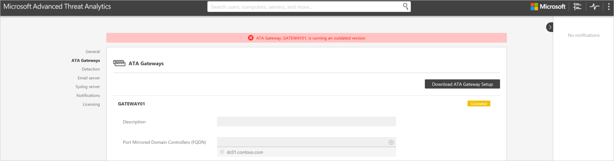

# Przewodnik po migracji związanej z aktualizacją usługi ATA do wersji 1.5
Aktualizacja usługi ATA do wersji 1.5 zapewnia następujące ulepszenia:

-   Szybsze wykrywanie

-   Rozszerzony algorytm automatycznego wykrywania dla urządzeń translacji adresów sieciowych

-   Rozszerzony proces rozpoznawania nazw dla urządzeń, które nie są dołączone do domeny

-   Obsługa migracji danych podczas aktualizacji produktów

-   Szybsza reakcja interfejsu użytkownika w przypadku podejrzanych działań związanych z tysiącami jednostek

-   Ulepszone automatyczne rozwiązywanie alertów monitorowania

-   Dodatkowe liczniki wydajności na potrzeby rozszerzonego monitorowania i rozwiązywania problemów

## Aktualizowanie usługi ATA do wersji 1.5
> [!NOTE]
> Jeśli usługa ATA nie jest zainstalowana w Twoim środowisku, pobierz pełną wersję usługi ATA, która zawiera wersję 1.5, i postępuj zgodnie ze standardową procedurą instalacji opisaną w artykule [Instalowanie usługi ATA](/advanced-threat-analytics/deploy-use/install-ata).

Jeśli została już wdrożona usługa ATA w wersji 1.4, ta procedura przeprowadzi Cię przez kroki niezbędne do aktualizacji instalacji.

Wykonaj następujące kroki, aby zaktualizować usługę ATA do wersji 1.5:

1.  Pobierz usługę ATA w wersji&1;.5 z centrum VLSC lub witryny MSDN.
      > [!NOTE]
         Możesz również zaktualizować usługę ATA do wersji 1.5 przy użyciu zaktualizowanej pełnej wersji usługi ATA.

2.  Zaktualizuj centrum usługi ATA

3.  Pobierz zaktualizowany pakiet bramy usługi ATA

4.  Zaktualizuj bramy usługi ATA

    > [!IMPORTANT]
    > Aby zapewnić prawidłowe działanie usługi ATA, zaktualizuj wszystkie bramy usługi ATA.

### Krok 1. Zaktualizuj centrum usługi ATA

1.  Utwórz kopię zapasową bazy danych: (opcjonalnie)

    -   Jeśli centrum usługi ATA jest uruchomione jako maszyna wirtualna i chcesz utworzyć punkt kontrolny, najpierw zamknij maszynę wirtualną.

    -   Jeśli centrum usługi ATA jest uruchomione na serwerze fizycznym, postępuj zgodnie z zalecaną procedurą, aby [utworzyć kopię zapasową bazy danych MongoDB](https://docs.mongodb.org/manual/core/backups/).

2.  Uruchom plik aktualizacji, Microsoft ATA Center Update.exe, i postępuj zgodnie z instrukcjami na ekranie, aby zainstalować aktualizację.

    1.  Na stronie **Zapraszamy** wybierz swój język i kliknij przycisk **Dalej**.

    2.  Przeczytaj umowę licencyjną użytkownika oprogramowania. Jeśli akceptujesz jej warunki, zaznacz pole wyboru i kliknij przycisk **Dalej**.

    3.  Określ, czy chcesz przeprowadzić migrację pełną (domyślnie), czy częściową.

        

        -   Jeśli wybierzesz migrację **Częściowa**, wszelkie zebrane i przekazane zdarzenia systemu Windows, związane z ruchem sieciowym, które są analizowane przez usługę ATA, zostaną usunięte i konieczne będzie ponowne rozpoznanie profilów behawioralnych użytkowników. Trwa to co najmniej trzy tygodnie. Jeśli masz mało miejsca na dysku, warto przeprowadzić migrację **Częściowa**.

        -   Jeśli wybierzesz migrację **Pełna**, będzie wymagane dodatkowe miejsce na dysku, obliczone na stronie uaktualnienia, a migracja może trwać dłużej, w zależności od ruchu sieciowego. Podczas pełnej migracji zachowywane są wszystkie uprzednio zebrane dane i profile behawioralne użytkowników, co oznacza, że usługa ATA nie wymaga dodatkowego czasu na rozpoznanie profilów behawioralnych, a nietypowe zachowania mogą być wykrywane bezpośrednio po aktualizacji.

3.  Kliknij przycisk **Aktualizuj**. Po kliknięciu przycisku Aktualizuj usługa ATA pozostaje w trybie offline do chwili, gdy procedura aktualizacji zostanie ukończona.

4.  Po zaktualizowaniu centrum usługi ATA bramy usługi ATA będą sygnalizować, że są przestarzałe.

    

> [!IMPORTANT]
> - Aby zapewnić prawidłowe działanie usługi ATA, zaktualizuj wszystkie bramy usługi ATA.

### Krok 2. Pobieranie pakietu instalacyjnego bramy usługi ATA
Po skonfigurowaniu ustawień łączności domeny możesz pobrać pakiet instalacyjny bramy usługi ATA.

Aby pobrać pakiet bramy usługi ATA:

1.  Usuń poprzednie wersje pakietu bramy usługi ATA, które zostały pobrane wcześniej.

2.  Na maszynie bramy usługi ATA otwórz przeglądarkę i wprowadź adres IP skonfigurowany w centrum usługi ATA dla konsoli usługi ATA. Po otwarciu konsoli usługi ATA kliknij ikonę ustawień i wybierz pozycję **Konfiguracja**.

    

3.  Na karcie **Bramy usługi ATA** kliknij pozycję **Pobierz instalatora bramy usługi ATA**.

4.  Zapisz pakiet lokalnie.

Plik zip zawiera następujące składniki:

-   Instalator bramy usługi ATA

-   Plik ustawień konfiguracji z informacjami wymaganymi do nawiązywania połączeń z centrum usługi ATA

### Krok 3. Zaktualizuj bramy usługi ATA

1.  Dla każdej bramy usługi ATA wyodrębnij pliki z pakietu bramy ATA i uruchom plik Microsoft ATA Gateway Setup.

    > [!NOTE]
    > Tego pakietu bramy usługi ATA możesz również używać do instalowania nowych bram usługi ATA.

2.  Twoje poprzednie ustawienia zostaną zachowane, ale ponowne uruchomienie usługi może potrwać kilka minut.

3.  Powtórz ten krok dla wszystkich innych wdrożonych bram usługi ATA.

> [!NOTE]
> Po pomyślnym zaktualizowaniu bramy usługi ATA nieaktualne powiadomienie dla tej bramy usługi ATA nie będzie już wyświetlane.

Jeśli wszystkie bramy usługi ATA zostaną pomyślnie zaktualizowane, wszystkie bramy usługi ATA będą sygnalizować pomyślne zsynchronizowanie, a komunikat o dostępności zaktualizowanego pakietu bramy usługi ATA nie będzie już wyświetlany.

## Zobacz też

- [Forum usługi ATA](https://social.technet.microsoft.com/Forums/security/home?forum=mata)

<!--HONumber=Feb17_HO1-->

