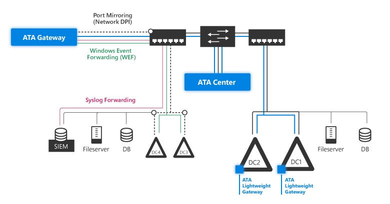

*Dotyczy: Advanced Threat Analytics w wersji 1.9*

# Wymagania wstępne usługi ATA
W tym artykule opisano wymagania dotyczące pomyślnego wdrożenia usługi ATA w środowisku.

> [!NOTE]
> Aby uzyskać więcej informacji o planowaniu zasobów i pojemności, zobacz temat [Planowanie pojemności usługi ATA](ata-capacity-planning.md).

Usługa ATA składa się z Centrum usługi ATA, bramy usługi ATA i/lub uproszczonej bramy usługi ATA. Aby uzyskać więcej informacji o składnikach usługi ATA, zobacz [Architektura usługi ATA](ata-architecture.md).

System ATA działa na granicy lasu usługi Active Directory i obsługuje poziom funkcjonalności lasu (FFL) systemu Windows 2003 lub nowszego.

[Przed rozpoczęciem](#before-you-start): w tej sekcji opisano informacje, które należy zebrać, oraz konta i jednostki sieciowe, które powinny istnieć przed rozpoczęciem instalacji usługi ATA.

[Centrum usługi ATA](#ata-center-requirements): ta sekcja zawiera informacje o wymaganiach centrum usługi ATA dotyczących sprzętu i oprogramowania, a także ustawieniach, które należy skonfigurować na serwerze centrum usługi ATA.

[Brama usługi ATA](#ata-gateway-requirements): ta sekcja zawiera informacje o wymaganiach bramy usługi ATA dotyczących sprzętu i oprogramowania, a także ustawieniach, które należy skonfigurować na serwerach bramy usługi ATA.

[Uproszczona brama usługi ATA](#ata-lightweight-gateway-requirements): w tej sekcji przedstawiono wymagania sprzętowe i programowe uproszczonej bramy usługi ATA.

[Konsola usługi ATA](#ata-console): ta sekcja zawiera informacje o wymaganiach dotyczących przeglądarek związanych z uruchamianiem konsoli usługi ATA.

## Przed rozpoczęciem
Ta sekcja zawiera informacje, które należy zebrać, a także konta i jednostki sieciowe, które powinny istnieć przed rozpoczęciem instalacji usługi ATA.

-   Konto użytkownika i hasło z dostępem do odczytu do wszystkich obiektów w monitorowanej domeny.

    > [!NOTE]
    > Jeśli ustawiono niestandardowe listy kontroli dostępu w różnych jednostkach organizacyjnych w domenie, upewnij się, że wybrany użytkownik ma uprawnienia do odczytu do tych jednostek organizacyjnych.

-   Nie należy instalować analizatora komunikatów firmy Microsoft na bramie usługi ATA lub uproszczonej bramy. Konflikty sterownik analizatora komunikatów ze sterownikami bramy usługi ATA i uproszczonej bramy. Jeśli uruchomiono program Wireshark na bramie usługi ATA, to należy ponownie uruchomić bramę usługi Microsoft Advanced Threat Analytics po zatrzymaniu przechwytywania za pomocą programu Wireshark. W przeciwnym razie brama przestanie Przechwytywanie ruchu. Uruchomienie programu Wireshark na uproszczonej bramy usługi ATA nie zakłóca uproszczonej bramy usługi ATA.

-    Zalecane: Użytkownik powinien mieć uprawnienia tylko do odczytu kontenera usuniętych obiektów. Dzięki temu usługa ATA to wykrywanie zbiorczego usuwania obiektów w domenie. Aby uzyskać informacje o konfigurowaniu uprawnień tylko do odczytu kontenera usuniętych obiektów, zobacz **Zmienianie uprawnień do kontenera usuniętych obiektów** sekcji [wyświetlanie lub ustawianie uprawnień do obiektu katalogu](https://technet.microsoft.com/library/cc816824%28v=ws.10%29.aspx) artykułu.

-   Opcjonalnie: Konto użytkownika użytkownika z żadne działania w sieci. To konto jest możliwość skonfigurowania użytkownika wystawionego jako przynęta usługi ATA. Aby skonfigurować konto usługi jako użytkownika wystawionego jako przynęta, wymagany jest tylko nazwy użytkownika. Aby uzyskać informacje o konfiguracji pułapki, zobacz [wykluczeń adresów IP, konfigurowanie i użytkownika wystawionego jako przynęta](install-ata-step7.md).

-   Opcjonalnie: Oprócz zbierania i analizowania ruchu sieciowego do i z kontrolerów domeny, usługa ATA umożliwia Windows zdarzeń 4776, 4732, 4733, 4728, 4729, 4756 i 4757 z dziennika ulepszanie ATA Pass--Hash, ataków siłowych, modyfikacji wrażliwych grup i Związane wystawionym jako przynęta wykrywania tokenów. Te zdarzenia mogą być odbierane z rozwiązania SIEM lub przez ustawienie funkcji przekazywania zdarzeń Windows z poziomu kontrolera domeny. Zebrane zdarzenia zapewniają usłudze ATA dodatkowe informacje niedostępne za pośrednictwem ruchu sieciowego kontrolera domeny.

## Wymagania centrum usługi ATA
Ta sekcja zawiera listę wymagań centrum usługi ATA.
### Ogólne
Centrum usługi ATA obsługuje instalację na serwerze z systemem Windows Server 2012 R2 lub Windows Server 2016. 

 > [!NOTE]
 > Centrum usługi ATA nie obsługuje systemu Windows Server core.

Centrum usługi ATA można zainstalować na serwerze, który jest elementem członkowskim domeny lub grupy roboczej.

Przed zainstalowaniem centrum usługi ATA w systemie Windows 2012 R2 upewnij się, że została zainstalowana następująca aktualizacja: [KB2919355](https://support.microsoft.com/kb/2919355/).

Możesz to sprawdzić, uruchamiając następujące polecenie cmdlet programu Windows PowerShell: `[Get-HotFix -Id kb2919355]`.

Instalacja centrum usługi ATA jako maszyny wirtualnej jest obsługiwana. 

> [!NOTE] 
> W przypadku uruchamiania jako pamięci dynamicznej maszyny wirtualnej lub innej pamięci funkcja przydziału balonowego nie jest obsługiwana.

Jeśli centrum usługi ATA jest uruchamiane jako maszyna wirtualna, należy wyłączyć serwer przed utworzeniem nowego punktu kontrolnego w celu uniknięcia potencjalnego uszkodzenia bazy danych.

### Specyfikacje serwera

Podczas pracy na serwerze fizycznym baza danych usługi ATA wymaga **wyłączenia** obsługi niejednolitego dostępu do pamięci (NUMA) w systemie BIOS. System może odwoływać się do architektury NUMA jako Przeplatanie, w którym to przypadku należy **Włącz** Przeplatanie, aby wyłączyć technologię NUMA. Aby uzyskać więcej informacji zajrzyj do dokumentacji systemu BIOS. 

Aby uzyskać optymalną wydajność, ustaw pozycję **Opcja zasilania** centrum usługi ATA na wartość **Wysoka wydajność**. 
Liczba monitorowanych kontrolerów domeny i obciążenie poszczególnych kontrolerów domeny decyduje o specyfikacjach serwera potrzebne. Aby uzyskać więcej informacji, zobacz [Planowanie pojemności usługi ATA](ata-capacity-planning.md).

### Synchronizacja czasu

Serwerze Centrum usługi ATA, serwerach bramy usługi ATA i kontrolerach domeny musi mieć różnica czasu ustawionego pięciu minut od siebie nawzajem.

### Karty sieciowe

Powinny być następujące:
-   Co najmniej jedna karta sieciowa (w przypadku korzystania z serwera fizycznego w środowisku sieci VLAN zaleca się używanie dwóch kart sieciowych)

-   Adres IP do komunikacji między centrum usługi ATA i bramy usługi ATA, która jest szyfrowana przy użyciu protokołu SSL na porcie 443. (Usługa ATA wiąże się na wszystkie adresy IP, które Centrum usługi ATA ma się na porcie 443).

### Porty
W poniższej tabeli wymieniono niezbędne porty, które należy otworzyć, aby centrum usługi ATA działało poprawnie.

|Protokół|Transport|Port|Do/z|Kierunek|
|------------|-------------|--------|-----------|-------------|
|**SSL** (komunikacja usługi ATA)|TCP|443|Brama usługi ATA|Przychodzące|
|**HTTP** (opcjonalnie)|TCP|80|Sieć firmowa|Przychodzące|
|**HTTPS**|TCP|443|Sieć firmowa i brama usługi ATA|Przychodzące|
|**SMTP** (opcjonalnie)|TCP|25|Serwer SMTP|Wychodzące|
|**SMTPS** (opcjonalnie)|TCP|465|Serwer SMTP|Wychodzące|
|**Syslog** (opcjonalnie)|TCP/UPS/TLS (z możliwością konfiguracji)|514 (ustawienie domyślne)|Serwer Syslog|Wychodzące|
|**LDAP**|TCP i UDP|389|Kontrolery domeny|Wychodzące|
|**LDAPS** (opcjonalnie)|TCP|636|Kontrolery domeny|Wychodzące|
|**DNS**|TCP i UDP|53|Serwery DNS|Wychodzące|
|**Kerberos** (opcjonalnie, jeśli przyłączono do domeny)|TCP i UDP|88|Kontrolery domeny|Wychodzące|
|**Czas Windows** (opcjonalnie, jeśli przyłączono do domeny)|UDP|123|Kontrolery domeny|Wychodzące|

> [!NOTE]
> LDAP jest wymagany do testowania poświadczenia do użycia między bram usługi ATA i kontrolerach domeny. Badanie odbywa się z Centrum usługi ATA do kontrolera domeny, aby przetestować ważności tych poświadczeń, po upływie których brama usługi ATA używa protokołu LDAP w ramach procesu zwykłej rozdzielczości.

### Certyfikaty

Aby zainstalować i szybciej wdrożenia usługi ATA, podczas instalacji możesz zainstalować certyfikaty z podpisem własnym. Jeśli zamierzasz używać certyfikatów z podpisem własnym, po początkowym wdrożeniu zalecane jest aby zamienić certyfikaty z podpisem własnym za pomocą certyfikatów z wewnętrznego urzędu certyfikacji, który ma być używany przez Centrum usługi ATA.

Upewnij się, że Centrum usługi ATA i bram usługi ATA mają dostęp do punktu dystrybucji z listy CRL. Jeśli nie mają dostępu do Internetu, postępuj zgodnie z [procedurę ręcznego importowania listy CRL](https://technet.microsoft.com/library/aa996972%28v=exchg.65%29.aspx), zwracając szczególną uwagę na instalowanie wszystkich dystrybucji listy CRL punkty dla całego łańcucha.

Certyfikat musi mieć:
-   Klucz prywatny
-   Typ dostawcy, dostawca usług kryptograficznych (CSP) lub dostawca magazynu kluczy (KSP)
-   Publiczny klucz o długości 2048 bitów
-   Wartość KeyEncipherment i ServerAuthentication flagi użycia
-   Parametr KeySpec (KeyNumber) wartość "KeyExchange" (w\_KEYEXCHANGE). Należy pamiętać, że wartość "Podpis" (w\_podpisu) nie jest obsługiwane. 

Na przykład, można użyć standardowego **serwera sieci Web** lub **komputera** szablonów.

> [!WARNING]
> Proces odnawiania istniejącego certyfikatu nie jest obsługiwane. Jest jedynym sposobem, aby odnowić certyfikat, tworząc nowy certyfikat i konfigurowania usługi ATA, aby używała nowego certyfikatu.

> [!NOTE]
> - Jeśli ma dostęp do konsoli usługi ATA z innych komputerów, upewnij się, że te komputery ufają certyfikatowi używanemu przez Centrum usługi ATA w przeciwnym razie zostanie wyświetlona strona ostrzeżenia z informacją czy występuje problem z certyfikatem zabezpieczeń witryny sieci Web przed przejściem do strony logowania.
> - Począwszy od wersji 1.8 usługi ATA bramy usługi ATA i uproszczonych bram są własne certyfikaty i zarządzanie muszą interakcji ze strony administratora do zarządzania nimi.

## Wymagania bramy usługi ATA
Ta sekcja zawiera listę wymagań bramy usługi ATA.
### Ogólne
Brama usługi ATA obsługuje instalację na serwerze z systemem Windows Server 2012 R2 lub Windows Server 2016 (w instalacji server core).
Brama usługi ATA może zostać zainstalowana na serwerze, który jest elementem członkowskim domeny lub grupy roboczej.
Brama usługi ATA może służyć do monitorowania kontrolerów domeny z poziomem funkcjonalności domeny systemu Windows 2003 lub nowszego.

Przed zainstalowaniem bramy usługi ATA w systemie Windows 2012 R2 upewnij się, że została zainstalowana następująca aktualizacja: [KB2919355](https://support.microsoft.com/kb/2919355/).

Możesz to sprawdzić, uruchamiając następujące polecenie cmdlet programu Windows PowerShell: `[Get-HotFix -Id kb2919355]`.

Aby uzyskać informacje o używaniu maszyn wirtualnych z bramą usługi ATA, zobacz [Konfigurowanie funkcji dublowania portów](configure-port-mirroring.md).

> [!NOTE]
> Minimalne miejsce wymagane to 5 GB, a zalecane to 10 GB. Obejmuje to miejsce wymagane dla plików binarnych ATA, dzienniki usługi ATA i [dzienników wydajności](troubleshooting-ata-using-perf-counters.md).

### Specyfikacje serwera
Aby uzyskać optymalną wydajność, ustaw pozycję **Opcja zasilania** bramy usługi ATA na wartość **Wysoka wydajność**. 
Brama usługi ATA może obsługiwać monitorowanie wielu kontrolerów domeny w zależności od natężenia ruchu sieciowego do i z kontrolerów domeny.

> [!NOTE] 
> W przypadku uruchamiania jako pamięci dynamicznej maszyny wirtualnej lub innej pamięci funkcja przydziału balonowego nie jest obsługiwana.

Aby uzyskać więcej informacji o wymaganiach sprzętowych bramy usługi ATA, zobacz [Planowanie pojemności usługi ATA](ata-capacity-planning.md).

### Synchronizacja czasu
Serwerze Centrum usługi ATA, serwerach bramy usługi ATA i kontrolerach domeny musi mieć różnica czasu ustawionego pięciu minut od siebie nawzajem.

### Karty sieciowe
Brama usługi ATA wymaga co najmniej jednej karty administracyjnej i co najmniej jednej karty sieciowej przechwytywania:

-   **Karta sieciowa zarządzania** — używany do komunikacji w sieci firmowej. Tę kartę należy skonfigurować następujące ustawienia:

    -   Statyczny adres IP obejmujący bramę domyślną

    -   Preferowane i alternatywne serwery DNS

    -   W polu **Sufiks DNS dla tego połączenia** należy podać nazwę DNS każdej monitorowanej domeny.

        

        > [!NOTE]
        > Jeśli brama usługi ATA jest elementem członkowskim domeny, te ustawienia mogą zostać skonfigurowane automatycznie.

-   **Karta przechwytywania** — używane do przechwytywania ruchu do i z kontrolerów domeny.

    > [!IMPORTANT]
    > -   Skonfiguruj funkcję dublowania portów dla karty przechwytywania jako miejsce docelowe ruchu sieciowego kontrolera domeny. Aby uzyskać więcej informacji, zobacz [Konfigurowanie funkcji dublowania portów](configure-port-mirroring.md). Zazwyczaj potrzebne do pracy z zespołem sieci lub wirtualizacji, aby skonfigurować funkcję dublowania portów.
    > -   Skonfiguruj statyczny adres IP bez obsługi routingu dla danego środowiska bez bramy domyślnej i bez adresów serwerów DNS. Na przykład 1.1.1.1/32. Gwarantuje to, że karta sieciowa przechwytywania może przechwytywać maksymalną ilość ruchu i że administracyjna karta sieciowa jest używana do wysyłania i odbierania wymaganego ruchu sieciowego.

### Porty
W poniższej tabeli wymieniono niezbędne porty, których skonfigurowanie na karcie administracyjnej jest wymagane przez bramę usługi ATA:

|Protokół|Transport|Port|Do/z|Kierunek|
|------------|-------------|--------|-----------|-------------|
|LDAP|TCP i UDP|389|Kontrolery domeny|Wychodzące|
|Bezpieczny protokół LDAP (LDAPS)|TCP|636|Kontrolery domeny|Wychodzące|
|LDAP do wykazu globalnego|TCP|3268|Kontrolery domeny|Wychodzące|
|LDAPS do wykazu globalnego|TCP|3269|Kontrolery domeny|Wychodzące|
|Kerberos|TCP i UDP|88|Kontrolery domeny|Wychodzące|
|Netlogon (SAM-R protokół SMB, CIFS)|TCP i UDP|445|Wszystkie urządzenia w sieci|Wychodzące|
|Czas systemu Windows|UDP|123|Kontrolery domeny|Wychodzące|
|systemem DNS,|TCP i UDP|53|Serwery DNS|Wychodzące|
|NTLM za pośrednictwem wywołania RPC|TCP|135|Wszystkie urządzenia w sieci|Oba|
|NetBIOS|UDP|137|Wszystkie urządzenia w sieci|Oba|
|Protokół SSL|TCP|443|Centrum usługi ATA|Wychodzące|
|Syslog (opcjonalnie)|UDP|514|Serwer SIEM|Przychodzące|

> [!NOTE]
> W ramach procesu rozpoznawania wykonywanego przez bramę usługi ATA następujące porty muszą być otwarte dla danych przychodzących z bram usługi ATA na urządzeniach w sieci.
>
> -   NTLM przez RPC (port TCP 135)
> -   NetBIOS (port UDP 137)
> - Przy użyciu konta użytkownika usługi katalogu, brama usługi ATA zapytania punktów końcowych w organizacji dla administratorów lokalnych przy użyciu SAM-R (logowanie do sieci), aby można było tworzyć [wykres ścieżki ruchu poprzecznego](use-case-lateral-movement-path.md). Aby uzyskać więcej informacji, zobacz [SAM-R skonfigurować wymagane uprawnienia](install-ata-step9-samr.md).
> - Następujące porty muszą być otwarte dla ruchu przychodzącego na urządzeniach w sieci z bramy usługi ATA:
>   -   NTLM przez RPC (Port TCP 135) do celów rozpoznawania
>   -   NetBIOS (UDP port 137) do celów rozpoznawania

## Wymagania dotyczące uproszczonej bramy usługi ATA
Ta sekcja zawiera listę wymagań uproszczonej bramy usługi ATA.
### Ogólne
Uproszczona brama usługi ATA obsługuje instalację na kontrolerze domeny z systemami Windows Server 2008 R2 z dodatkiem SP1 (bez instalacji Server Core), Windows Server 2012, Windows Server 2012 R2, Windows Server 2016 (z instalacją Core, ale nie Nano).

Kontroler domeny może być kontrolerem domeny tylko do odczytu (RODC).

Przed zainstalowaniem uproszczonej bramy usługi ATA na kontrolerze domeny z systemem Windows Server 2012 R2 upewnij się, że zainstalowano następującą aktualizację: [KB2919355](https://support.microsoft.com/kb/2919355/).

Możesz to sprawdzić, uruchamiając następujące polecenie cmdlet programu Windows PowerShell: `[Get-HotFix -Id kb2919355]`

W przypadku instalacji systemu Windows Server 2012 R2 Server Core musisz również zainstalować następującą aktualizację: [KB3000850](https://support.microsoft.com/help/3000850/november-2014-update-rollup-for-windows-rt-8.1%2c-windows-8.1%2c-and-windows-server-2012-r2).

 Możesz to sprawdzić, uruchamiając następujące polecenie cmdlet programu Windows PowerShell: `[Get-HotFix -Id kb3000850]`

Podczas instalacji instalowany jest program .Net Framework 4.6.1, który może spowodować ponowny rozruch kontrolera domeny.

> [!NOTE]
> Minimalne miejsce wymagane to 5 GB, a zalecane to 10 GB. Obejmuje to miejsce wymagane dla plików binarnych ATA, dzienniki usługi ATA i [dzienników wydajności](troubleshooting-ata-using-perf-counters.md).

### Specyfikacje serwera

Uproszczona brama usługi ATA wymaga co najmniej 2 rdzeni i 6 GB pamięci RAM zainstalowanych na kontrolerze domeny.
Aby uzyskać optymalną wydajność, ustaw pozycję **Opcja zasilania** uproszczonej bramy usługi ATA na wartość **Wysoka wydajność**.
Uproszczoną bramę usługi ATA można wdrożyć na kontrolerach domeny o różnych obciążeniach i rozmiarach, w zależności od ilości ruchu sieciowego w kontrolerach domeny oraz ilości zasobów zainstalowanych w danym kontrolerze domeny.

> [!NOTE] 
> W przypadku uruchamiania jako pamięci dynamicznej maszyny wirtualnej lub innej pamięci funkcja przydziału balonowego nie jest obsługiwana.

Aby uzyskać więcej informacji o wymaganiach sprzętowych bramy ATA Lightweight Gateway, zobacz [Planowanie pojemności usługi ATA](ata-capacity-planning.md).

### Synchronizacja czasu

Serwerze Centrum usługi ATA, serwerach uproszczonej bramy usługi ATA i kontrolerach domeny musi mieć różnica czasu ustawionego pięciu minut od siebie nawzajem.

### Karty sieciowe

Uproszczona brama usługi ATA monitoruje lokalny ruch na wszystkich kartach sieciowych kontrolera domeny.  
Po przeprowadzeniu wdrożenia możesz użyć konsoli usługi ATA, jeśli chcesz określić, które karty sieciowe są monitorowane.

> [!NOTE]
> Uproszczona brama nie jest obsługiwana w domenie, kontrolerów z systemem Windows 2008 R2 z Broadcom kart sieciowych jest włączona.

### Porty
W poniższej tabeli wymieniono niezbędne porty wymagane przez uproszczoną bramę usługi ATA:

|Protokół|Transport|Port|Do/z|Kierunek|
|------------|-------------|--------|-----------|-------------|
|systemem DNS,|TCP i UDP|53|Serwery DNS|Wychodzące|
|NTLM za pośrednictwem wywołania RPC|TCP|135|Wszystkie urządzenia w sieci|Oba|
|NetBIOS|UDP|137|Wszystkie urządzenia w sieci|Oba|
|Protokół SSL|TCP|443|Centrum usługi ATA|Wychodzące|
|Syslog (opcjonalnie)|UDP|514|Serwer SIEM|Przychodzące|
|Netlogon (SAM-R protokół SMB, CIFS)|TCP i UDP|445|Wszystkie urządzenia w sieci|Wychodzące|

> [!NOTE]
> W ramach procesu rozpoznawania wykonywanego przez uproszczoną bramę usługi ATA następujące porty muszą być otwarte dla danych przychodzących z uproszczonych bram usługi ATA na urządzeniach w sieci.
>
> -   NTLM za pośrednictwem wywołania RPC
> -   NetBIOS
> - Przy użyciu konta użytkownika usługi katalogu, bramy ATA Lightweight Gateway zapytania punktów końcowych w organizacji dla administratorów lokalnych przy użyciu SAM-R (logowanie do sieci), aby można było tworzyć [wykres ścieżki ruchu poprzecznego](use-case-lateral-movement-path.md). Aby uzyskać więcej informacji, zobacz [SAM-R skonfigurować wymagane uprawnienia](install-ata-step9-samr.md).
> - Następujące porty muszą być otwarte dla ruchu przychodzącego na urządzeniach w sieci z bramy usługi ATA:
>   -   NTLM przez RPC (Port TCP 135) do celów rozpoznawania
>   -   NetBIOS (UDP port 137) do celów rozpoznawania

## Konsola usługi ATA
Dostęp do konsoli usługi ATA jest za pośrednictwem przeglądarki. obsługiwane przeglądarki i ustawienia:

-   Internet Explorer 10 i nowsze

-   Microsoft Edge

-   Google Chrome 40 i nowsze

-   Minimalna rozdzielczość ekranu w poziomie: 1700 pikseli

## Pokrewne wideo
- [Wybieranie odpowiedniego typu bramy usługi ATA](https://channel9.msdn.com/Shows/Microsoft-Security/ATA-Deployment-Choose-the-Right-Gateway-Type)

## Zobacz też
- [Narzędzia do określania rozmiaru usługi ATA](http://aka.ms/atasizingtool)
- [Architektura usługi ATA](ata-architecture.md)
- [Instalowanie usługi ATA](install-ata-step1.md)
- [Forum usługi ATA](https://social.technet.microsoft.com/Forums/security/home?forum=mata)

