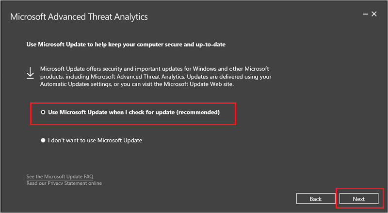

# Aktualizowanie usługi ATA do wersji 1.9

> [!NOTE] 
> Jeśli usługa ATA nie jest zainstalowana w Twoim środowisku, Pobierz pełną wersję usługi ATA, która zawiera wersję 1.9 i postępuj zgodnie ze standardową procedurą instalacji opisane w [Instalowanie usługi ATA](install-ata-step1.md).

Jeśli masz już usługi ATA w wersji 1.8 wdrożone, ta procedura przeprowadzi Cię przez kroki niezbędne do aktualizacji wdrożenia.

> [!NOTE] 
>  Tylko usługi ATA w wersji 1.8 (1.8.6645) i aktualizacja usługi ATA 1.8 1 (1.8.6765) można zaktualizować usługę ATA do wersji 1.9, jakakolwiek wcześniejsza wersja usługi ATA nie można bezpośrednio zaktualizować usługę ATA do wersji 1.9.

Wykonaj następujące kroki, aby zaktualizować usługę ATA do wersji 1.9:

1.  [Pobierz wersję aktualizacji 1.9 usługi ATA z Centrum pobierania](https://www.microsoft.com/download/details.aspx?id=56725) lub pełnej wersji z [Eval center](http://www.microsoft.com/evalcenter/evaluate-microsoft-advanced-threat-analytics). 
W wersji migracji pliku może służyć tylko w przypadku aktualizowania z 1.8 usługi ATA. W przypadku wersji z centrum wersji ewaluacyjnych ten sam plik instalacyjny (Microsoft ATA Center Setup.exe) jest używany do instalowania nowych wdrożeń usługi ATA i uaktualniania istniejących wdrożeń.

2.  Zaktualizuj centrum usługi ATA

4.  Zaktualizuj bramy usługi ATA

    > [!IMPORTANT]
    > Aby zapewnić prawidłowe działanie usługi ATA, zaktualizuj wszystkie bramy usługi ATA.

### Krok 1. Zaktualizuj centrum usługi ATA

1.  Utwórz kopię zapasową bazy danych: (opcjonalnie)

    -   Jeśli Centrum usługi ATA jest uruchomione jako maszyny wirtualnej i chcesz utworzyć punkt kontrolny, najpierw zamknij maszynę wirtualną.

    -   Jeśli centrum usługi ATA jest uruchomione na serwerze fizycznym, zobacz artykuł [Odzyskiwanie po awarii](disaster-recovery.md), aby uzyskać informacje o tworzeniu kopii zapasowej bazy danych.

2.  Uruchom plik instalacyjny **Microsoft ATA Center Setup.exe** i postępuj zgodnie z instrukcjami na ekranie, aby zainstalować aktualizację.

    -  Na stronie **Zapraszamy** wybierz swój język i kliknij przycisk **Dalej**.

    -  Jeśli nie włączysz aktualizacji automatycznych w wersji 1.8, zostanie wyświetlony monit ustawić ATA Użyj usługi Microsoft Update, aby usługa ATA pozostaje aktualne.  Na stronie Microsoft Update wybierz pozycję **Użyj usługi Microsoft Update, gdy wyszukuję aktualizacje (zalecane)**.
    
     
     To można dostosować ustawienia systemu Windows w celu włączenia aktualizacji usługi ATA. 
    
    -  **Migracji danych z częściowa** ekranu informujące, że ruch sieciowy wcześniej przechwycone, zdarzenia, jednostki i wykrywania powiązane dane zostaną usunięte. Wszystkie wykrycia pracować bezpośrednio z wyjątkiem wykrywania nietypowe zachowanie, nietypowe grupy modyfikacji, Rekonesans przy użyciu usług katalogowych (SAM-R) i wykrycia obniżenia poziomu szyfrowania, przyjmujących trzy tygodnie do tworzenia profilu pełną po czas nauki wymagane. 
     
      

    -  Kliknij przycisk **Aktualizuj**. Po kliknięciu przycisku Aktualizuj usługa ATA pozostaje w trybie offline do chwili, gdy procedura aktualizacji zostanie ukończona.

4.  Po pomyślnym ukończeniu aktualizacji centrum usługi ATA kliknij przycisk **Uruchom**, aby otworzyć ekran **Aktualizacja** w konsoli bram usługi ATA.

     

5.  W **aktualizacje** ekranu, jeśli ustawisz bram usługi ATA do automatycznego aktualizowania one aktualizacji w tym momencie, jeśli nie, kliknij przycisk **aktualizacji** obok każdej bramy usługi ATA.
  
     

  
> [!IMPORTANT] 
> Aby zapewnić prawidłowe działanie usługi ATA, zaktualizuj wszystkie bramy usługi ATA.
 
> [!NOTE] 
> Aby zainstalować nowych bram usługi ATA, przejdź **bram** ekranu, a następnie kliknij przycisk **Pobierz instalatora bramy** pobrać pakiet instalacyjny bramy usługi ATA 1.9, a następnie postępuj zgodnie z instrukcjami dotyczącymi nowa instalacja bramy jako opisane w [krok 4. Instalowanie bramy usługi ATA](install-ata-step4.md).

## Zobacz też

- [Forum usługi ATA](https://social.technet.microsoft.com/Forums/security/home?forum=mata)
