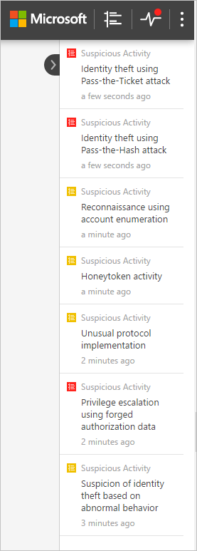
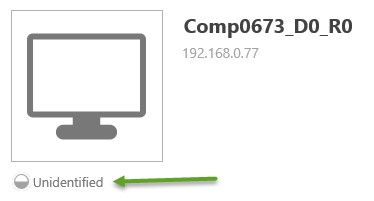

*Dotyczy: Advanced Threat Analytics w wersji 1.8*

# Praca z konsolą usługi ATA

Konsola usługi ATA służy do monitorowania podejrzanych działań wykrytych przez usługę ATA i reagowania na nie.

Wpisanie znaku ? spowoduje wyświetlenie skrótów klawiaturowych dla ułatwień dostępu w portalu usługi ATA. 

## Włączanie dostępu do konsoli usługi ATA
Aby pomyślnie zalogować się do konsoli usługi ATA, należy użyć konta użytkownika, który został przypisany do właściwej roli usługi ATA z dostępem do konsoli ATA. Aby uzyskać więcej informacji na temat kontroli dostępu opartego na rolach (RBAC) w usłudze ATA, zobacz [Praca z grupami ról usługi ATA](ata-role-groups.md).

## Logowanie się do konsoli usługi ATA

>[!NOTE]
 > Począwszy od usługi ATA 1.8, proces logowania do konsoli usługi ATA odbywa się przy użyciu logowania jednokrotnego.

1. Na serwerze centrum usługi ATA kliknij ikonę **Konsola usługi Microsoft ATA** na pulpicie lub otwórz przeglądarkę i przejdź do konsoli usługi ATA.

    

 >[!NOTE]
 > Możesz również otworzyć przeglądarkę z poziomu centrum usługi ATA lub bramy usługi ATA i przejść na adres IP skonfigurowany dla konsoli usługi ATA w instalacji centrum usługi ATA.    

2.  Jeśli komputer, na którym zainstalowano centrum usługi ATA, i komputer, z którego próbujesz uzyskać dostęp do konsoli usługi ATA, są przyłączone do domeny, usługa ATA obsługuje logowanie jednokrotne zintegrowane z uwierzytelnianiem systemu Windows — jeśli użytkownik został już zalogowany na komputerze, usługa ATA użyje tego tokenu do zalogowania do konsoli usługi ATA. Możesz również się zalogować przy użyciu karty inteligentnej. Uprawnienia w usłudze ATA będą odpowiadać Twojej [roli administratora](ata-role-groups.md).

 > [!NOTE]
 > Pamiętaj, żeby zalogować się na komputerze, z którego chcesz uzyskać dostęp do konsoli usługi ATA, przy użyciu nazwy użytkownika i hasła administratora usługi ATA. Zamiast tego możesz też uruchomić przeglądarkę jako inny użytkownik lub wylogować się z systemu Windows i zalogować jako administrator usługi ATA. Aby spowodować, żeby konsola usługi ATA zapytała o poświadczenia, uzyskaj dostęp do konsoli przy użyciu adresu IP, a wtedy pojawi się monit o podanie poświadczeń.

3. Aby zalogować się przy użyciu logowania jednokrotnego, upewnij się, że witryna konsoli usługi ATA jest zdefiniowana jako lokalna witryna intranetowa w przeglądarce i że uzyskujesz do niej dostęp za pomocą nazwy skróconej lub hosta lokalnego.

> [!NOTE]
> Oprócz rejestrowania każdego podejrzanego działania i alertu kondycji, każda zmiana konfiguracji wprowadzona w konsoli usługi ATA podlega inspekcji w dzienniku zdarzeń systemu Windows na komputerze z centrum usługi ATA, w obszarze **Dziennik aplikacji i usług**, a następnie **Microsoft ATA**. Każde logowanie do konsoli usługi ATA również podlega inspekcji.    Konfiguracja wpływająca na bramę usługi ATA jest również rejestrowana w dzienniku zdarzeń systemu Windows na komputerze bramy usługi ATA. 

## Konsola usługi ATA

Konsola usługi ATA zapewnia szybki przegląd wszystkich podejrzanych działań w kolejności chronologicznej. Umożliwia przejście do szczegółów dowolnego działania i wykonanie operacji w oparciu o te działania. W konsoli są również wyświetlane alerty i powiadomienia wyróżniające problemy dotyczące sieci usługi ATA lub nowe działania uznane za podejrzane.

Są to kluczowe elementy konsoli usługi ATA.

### Oś czasu ataków

Jest to domyślna strona docelowa wyświetlana po zalogowaniu się do konsoli usługi ATA. Domyślnie wszystkie otwarte podejrzane działania są wyświetlane na osi czasu ataków. Oś czasu ataków można filtrować, aby wyświetlać Wszystkie, Otwarte, Odrzucone lub Rozwiązane podejrzane działania. Można również sprawdzić ważność przypisaną do poszczególnych działań.

Aby uzyskać więcej informacji, zobacz [Praca z podejrzanymi działaniami](working-with-suspicious-activities.md).

### Pasek powiadomień

Po wykryciu nowego podejrzanego działania pasek powiadomień zostanie otwarty automatycznie po prawej stronie. Jeśli od czasu ostatniego zalogowania miały miejsce nowe podejrzane działania, pasek powiadomień zostanie otwarty po pomyślnym zalogowaniu. W dowolnym momencie można uzyskać dostęp do paska powiadomień, klikając strzałkę po prawej stronie.

### Panel filtrowania

Podejrzane działania wyświetlane na osi czasu ataków lub na karcie podejrzanych działań profilu jednostki można filtrować na podstawie stanu i ważności.

### Pasek wyszukiwania

W menu u góry znajduje się pasek wyszukiwania. Umożliwia on wyszukiwanie określonych użytkowników, komputerów lub grup w usłudze ATA. Aby go wypróbować, po prostu zacznij wpisywać tekst.

### Centrum kondycji

Centrum kondycji zapewnia alerty, gdy coś nie działa prawidłowo we wdrożeniu usługi ATA.

Za każdym razem, gdy system napotka problem, taki jak błąd łączności lub rozłączona brama usługi ATA, ikona centrum kondycji poinformuje o nim użytkownika przez wyświetlenie czerwonej kropki. 

Alerty centrum kondycji można odrzucać lub rozwiązywać. Są również podzielone na kategorie Wysoka, Średnia lub Niska w zależności od ważności. W przypadku rozwiązania alertu, który jest nadal wykrywany przez usługę ATA jako aktywny, zostanie on automatycznie przeniesiony do listy otwartych alertów. Jeśli system wykryje, że przyczyna alertu już nie istnieje (problem został rozwiązany), alert zostanie przeniesiony do listy rozwiązanych.

### Profile użytkowników i komputerów

Usługa ATA tworzy profil dla każdego użytkownika i komputera w sieci. W profilu użytkownika usługi ATA wyświetlane są ogólne informacje, takie jak członkostwo w grupie, ostatnie logowania i ostatnio używane zasoby. Zawiera także listę lokalizacji, z którymi użytkownik jest połączony za pośrednictwem sieci VPN. Aby uzyskać listę członkostwa w grupach, które usługa ATA uważa za wrażliwe, zobacz poniżej.

W profilu komputera usługa ATA wyświetla ogólne informacje, takie jak ostatnie logowania i ostatnio używane zasoby.

Usługa ATA zapewnia dodatkowe informacje na temat jednostek (komputerów, urządzeń i użytkowników) na następujących stronach: Podsumowanie, Działania i Podejrzane działania.

Profil, który nie mógł zostać całkowicie rozwiązany przez usługę ATA, zostanie oznaczony ikoną koła wypełnionego do połowy umieszczoną obok niego.

### Wrażliwe grupy

Grupy na poniższej liście są uważane za **wrażliwe** przez usługę ATA. Każda jednostka, która należy do poniższych grup, jest traktowana jako wrażliwa:

- Kontrolery domeny tylko do odczytu na poziomie organizacji 
- Administratorzy domeny 
- Kontrolery domeny 
- Administratorzy schematu,
- Enterprise Admins 
- Twórcy-właściciele zasad grupy 
- Kontrolery domeny tylko do odczytu 
- Administratorzy  
- Użytkownicy zaawansowani  
- Operatorzy kont  
- Operatorzy serwerów   
- Operatorzy drukowania
- Operatorzy kopii zapasowych
- Replikatorzy 
- Użytkownicy pulpitu zdalnego 
- Operatorzy konfiguracji sieci 
- Konstruktorzy przychodzących zaufań lasu 
- Administratorzy usługi DNS 

### Mini profil

W dowolnym miejscu w konsoli, gdzie wyświetlana jest pojedyncza jednostka, taka jak użytkownik lub komputer, umieszczenie wskaźnika myszy na jednostce spowoduje automatyczne otwarcie mini profilu zawierającego następujące informacje, jeśli są dostępne:

-   Nazwa

-   Obraz

-   Poczta e-mail

-   Telefon

-   Liczba podejrzanych działań według ważności

## Zobacz też
[Forum usługi ATA](https://social.technet.microsoft.com/Forums/security/home?forum=mata)
