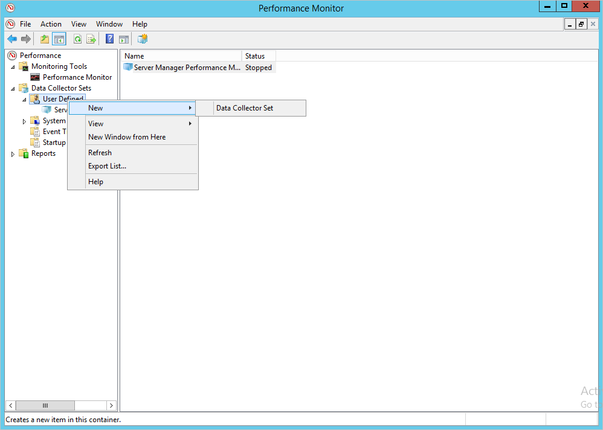

*Dotyczy: Azure Advanced Threat Protection*

# Planowanie pojemności Azure w ATP
Ten artykuł ułatwia określenie, ile czujniki Azure ATP i czujników autonomicznego należy.

> [!NOTE] 
> Narzędzie ustalania wielkości ma dwa arkusze — jeden dla usługi ATA i jeden dla Azure ATP. Upewnij się, że jesteś w arkuszu poprawne.

## Korzystanie z narzędzia do określania rozmiaru
Zalecaną i najprostszą metodą ustalenia pojemności na potrzeby wdrożenia Azure ATP jest użycie [narzędzia do określania rozmiaru ATP Azure](http://aka.ms/aatpsizingtool). Uruchom narzędzie Azure ATP zmiany rozmiaru i wyniki pliku programu Excel, użyj następujących pól do określenia pamięci i procesora CPU używanego przez czujnika:

- Azure czujnik ATP: dopasowania **zajęte pakiety/s** tabeli czujnik Azure ATP w pliku wyników do **pakietów na SEKUNDĘ** w [Azure ATP autonomiczny czujnik tabeli](#azure-atp-sensor-sizing)lub [tabeli czujnik Azure ATP](#azure-atp-standalone-sensor-sizing)w zależności od [wybranego typu czujnika](#choosing-the-right-sensor-type-for-your-deployment).

Jeśli z jakiegoś powodu nie można użyć narzędzia do określania rozmiaru ATP Azure, ręcznie zebrać informacje licznika pakietów na sekundę ze wszystkich kontrolerów domeny przez 24 godziny z krótkim interwałem zbierania (około 5 sekund). Następnie dla każdego kontrolera domeny musisz obliczyć średnią wartość dzienną i średnią z okresu o największym obciążeniu (15 minut).
Poniższe sekcje zawierają instrukcje dotyczące zbierania informacji licznika pakietów na sekundę z jednego kontrolera domeny.

## Wybieranie typu czujnika prawo do wdrożenia
We wdrożeniu Azure ATP dowolną kombinację typów czujnik autonomiczny Azure ATP jest obsługiwana:

- Tylko czujników autonomiczny Azure ATP
- Tylko czujnik Azure ATP
- Kombinacja obu bram

Podczas wybierania typu wdrożenia czujnik należy wziąć pod uwagę następujące korzyści:

|Czujnik typu|Korzyści|Koszt|Topologia wdrożenia|Użycie kontrolera domeny|
|----|----|----|----|-----|
|Azure czujnik autonomiczny ATP|Wdrożenie poza pasmem utrudnia osobom atakującym odkrycie Azure ATP jest obecny|Wyższe|Instalacja obok kontrolera domeny (poza pasmem)|Obsługuje maksymalnie 100 000 pakietów na sekundę|
|Azure czujnik ATP|Nie wymaga dedykowanego serwera i konfiguracji dublowania portów|Niższe|Instalacja na kontrolerze domeny|Obsługuje maksymalnie 100 000 pakietów na sekundę|

Podczas podejmowania decyzji o ile czujniki autonomiczny Azure ATP do wdrożenia, należy wziąć pod uwagę następujące kwestie.

-   **Lasy i domeny usługi Active Directory** 
    Azure ATP można monitorować ruch z wielu domen w jednym lesie usługi Active Directory dla każdego obszaru roboczego, którą utworzysz. Monitorowanie wielu lasów, należy utworzyć wiele obszarów roboczych. 

-   **Dublowanie portów** 
Specyfika funkcji dublowania portów mogą wymagać wdrożenia wielu czujników autonomiczny Azure ATP dla każdej witryny Centrum lub gałęzi danych.

-   **Wydajność** 
    Czujnik autonomiczny Azure ATP może obsługiwać monitorowanie wielu kontrolerów domeny, w zależności od natężenia ruchu sieciowego monitorowanych kontrolerów domeny. 

## Czujnik ATP Azure i zmianę rozmiaru czujnik autonomiczny 

Czujnik Azure ATP może obsługiwać monitorowanie jednego kontrolera domeny na podstawie ilości ruchu sieciowego, generowanych przez kontroler domeny. Poniższa tabela jest szacowana, ostateczna kwota, która analizuje czujnika jest zależna od ilości ruchu sieciowego i dystrybucja ruchu. 
> [!NOTE]
> Następujące możliwości procesora CPU i pamięci odwołuje się do zużycia własnych czujnik — nie pojemności kontrolera domeny.

|Pakiety na sekundę *|Procesor CPU (rdzenie)|Pamięć (GB)|
|----|----|-----|
|0-1 k|0.25|2.50|
|1k-5k|0.75|6.00|
|5k-10k|1.00|6.50|
|10k-20k|2.00|9,00|
|20k-50k|3.50|9,50|
|50k-75k |3.50|9,50|
|75k-100k|3.50 |9,50|

> [!NOTE]
> - Całkowita liczba rdzeni, które będzie używane przez usługę czujnik. Zaleca się, że nie działają z rdzeni hiperwątkowych.
> - Całkowita ilość pamięci, która będzie używać usługa czujnik.
> -   Jeśli kontroler domeny nie ma zasobów wymaganych przez czujnik Azure ATP, nie wpływa na wydajność kontrolera domeny, ale czujnik Azure ATP może nie działać zgodnie z oczekiwaniami.
> -   W przypadku uruchamiania jako pamięci dynamicznej maszyny wirtualnej lub innej pamięci funkcja przydziału balonowego nie jest obsługiwana.
> -   Aby uzyskać optymalną wydajność, ustaw **opcja zasilania** czujnika Azure ATP do **wysokiej wydajności**.
> -   Wymagane jest co najmniej 2 rdzeni i 6 GB miejsca i 10 GB jest zalecane, w tym miejsce wymagane do plików binarnych Azure ATP i dzienniki.

## Szacowanie ruchu kontrolera domeny

Istnieją różne narzędzia, za pomocą których można określić średnią liczbę pakietów na sekundę kontrolerów domeny. Jeśli nie masz żadnych narzędzi do określenia tej wartości, możesz użyć Monitora wydajności do zebrania wymaganych informacji.

Aby określić liczbę pakietów na sekundę, wykonaj następujące kroki na każdym kontrolerze domeny:

1.  Otwórz Monitor wydajności.

    

2.  Rozwiń węzeł **Zestawy modułów zbierających dane**.

    

3.  Kliknij prawym przyciskiem myszy pozycję **Zdefiniowany przez użytkownika**, a następnie wybierz pozycję **Nowy** &gt; **Zestaw modułów zbierających dane**.

    

4.  Wprowadź nazwę dla zestawu modułów zbierających dane, a następnie wybierz pozycję **Utwórz ręcznie (zaawansowane)**.

5.  W obszarze **Jakiego typu dane chcesz uwzględnić?** wybierz pozycje **Utwórz dzienniki danych i Licznik wydajności**.

    

6.  W obszarze **Które liczniki wydajności chcesz rejestrować?** kliknij przycisk **Dodaj**.

7.  Rozwiń węzeł **Karta sieciowa**, wybierz pozycję **Pakiety/s**, a następnie wybierz odpowiednie wystąpienie. Jeśli nie masz pewności, możesz wybrać pozycję **&lt;Wszystkie wystąpienia&gt;**, kliknąć przycisk **Dodaj**, a następnie kliknąć przycisk **OK**.

    > [!NOTE]
    > Aby wykonać tę operację w wierszu polecenia, uruchom polecenie `ipconfig /all` w celu wyświetlenia nazwy karty i konfiguracji.

    

8.  Zmień **interwału próbkowania** do **pięciu sekund**.

9. Ustaw lokalizację, w której mają być zapisywane dane.

10. W obszarze **utworzyć zestaw modułów zbierających dane**, wybierz pozycję **uruchomić ten zestaw modułów zbierających dane teraz**i kliknij przycisk **Zakończ**.

    Powinien zostać wyświetlony utworzony zestaw modułów zbierających dane z zielonym trójkątem wskazującym, że zestaw działa.

11. Po 24 godzinach zatrzymaj zestaw modułów zbierających dane, klikając go prawym przyciskiem myszy, a następnie wybierając polecenie **Zatrzymaj**.

    

12. W Eksploratorze plików przejdź do folderu, w którym zapisano plik blg, a następnie kliknij go dwukrotnie w celu otworzenia w Monitorze wydajności.

13. Wybierz licznik Pakiety/s i zapisz wartość średnią oraz maksymalną.

    

## Zobacz też
- [Narzędzia do określania rozmiaru Azure ATP](http://aka.ms/aatpsizingtool)
- [Wymagania wstępne Zaawansowanej ochrony przed zagrożeniami na platformie Azure](atp-prerequisites.md)
- [Architektura Zaawansowanej ochrony przed zagrożeniami na platformie Azure](atp-architecture.md)
- [Zapoznaj się z forum ATP!](https://aka.ms/azureatpcommunity)
